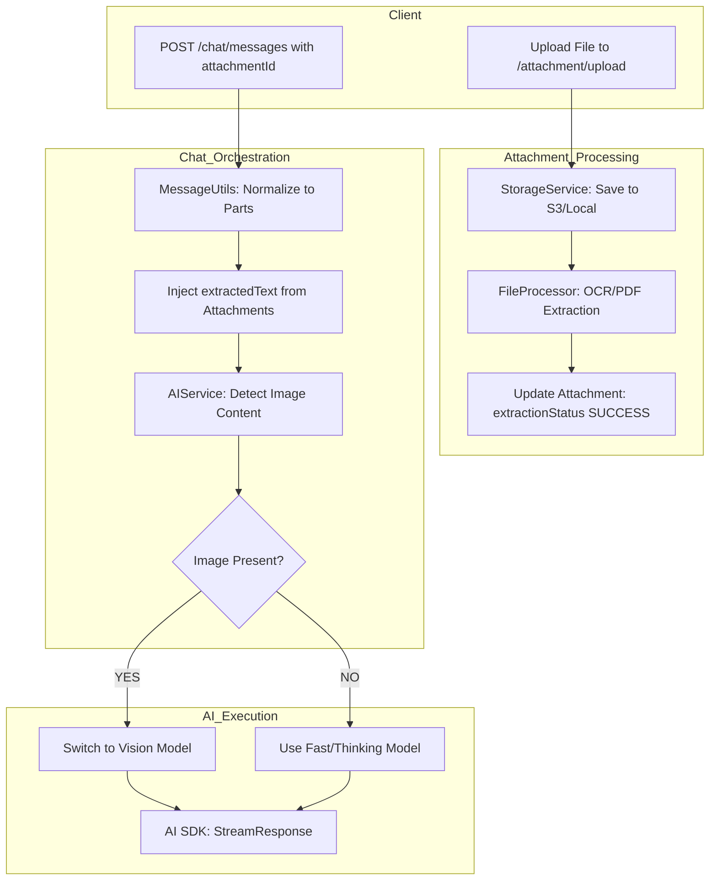

# Better Dev API - Multi-Modal Architecture (Current)

This document describes the modern, multi-modal architecture of the Better Dev API, which supports text, images, and documents (PDFs, Docx).

## 🏗️ High-Level Design (HLD)

The API has evolved into a **Multi-Modal AI Engine**. It uses a sophisticated message-part system and an asynchronous file processing pipeline.

### System Components

- **Attachment Module:** Handles file uploads, multi-backend storage (S3/Local), and content extraction (OCR/PDF Parsing).
- **Multi-Part Message System:** Replaces simple text with a `parts` array, allowing mixed media in a single message.
- **Vision Intelligence:** Automatically detects images and switches to vision-capable models (e.g., Llama 4 Scout).
- **Asynchronous Processing:** Extracts text from non-image files in the background and injects it into the AI context.

---

## 📂 Key Modules & Responsibilities

### 1. Attachment Module (`src/modules/attachment`)
*The gateway for all visual and document-based data.*

- **`storage.service.ts`**: Abstracts storage logic. Can use **DigitalOcean Spaces (S3)** for production or **Local Storage** for development.
- **`file-processor.service.ts`**: The "Parser".
    - **Images:** Uses **Tesseract.js** for OCR and **Sharp** for thumbnailing.
    - **PDFs:** Uses **pdf-parse** to extract text.
    - **Documents:** Uses **mammoth** to convert Word docs to text.
- **`attachment.service.ts`**: Coordinates uploads, enforces file size limits, and triggers the processing pipeline.

### 2. Multi-Part Chat System (`src/modules/chat`)
*Handling complex conversations.*

- **`message.entity.ts`**: Now features a `parts` (JSONB) column. Each part has a `type` (text, image, file, tool-call, etc.).
- **`token-limits.config.ts`**: Centralized thresholds for context windows (e.g., 32k tokens per doc, 64k total context).
- **`message.utils.ts`**: Normalizes input from the frontend and formats it for the AI SDK v5.
- **`chat.service.ts`**:
    - Aggregates text from both message content and `extractedText` from attachments.
    - Implements **Threshold-Based Truncation**: Automatically cuts off text exceeding token limits to ensure LLM stability.
    - Manages the persistence of complex multi-part histories.

### 3. Core AI & Vision (`src/modules/core`)
*The intelligence layer.*

- **`ai.service.ts`**: 
    - **Vision Detection**: Automatically checks if `parts` contain images.
    - **Auto-Switching**: If images are found, it switches the `effectiveMode` to `vision`.
    - **Model Selection**: Uses `llama-4-scout-17b-16e-instruct` for vision and `llama-3.1-8b` for standard text.

---

## 🔄 Multi-Modal Data Flow

---

## 📊 Entity Relationship Diagram (ERD)

- **Conversation** (1 : N) **Message**
- **Message** (1 : N) **Attachment**
- **Message** (JSONB) **parts**: `[{ type: 'text', text: '...' }, { type: 'image', url: '...' }, { type: 'file', attachmentId: '...' }]`

---

## 🛠️ Key Architectural Patterns

- **Threshold Strategy:** Enforces token-based limits (32k/64k) to maintain performance before transitioning to RAG.
- **Multi-Part Serialization:** Allows for future-proof support of audio, video, and other modalities.
- **Asynchronous Extraction:** Offloads heavy PDF/OCR tasks from the main request thread.
- **Strategy Pattern:** Dynamically selects models based on the detected content type (Text vs. Vision).
- **Service-Based Storage:** Decouples the API from specific storage providers.
