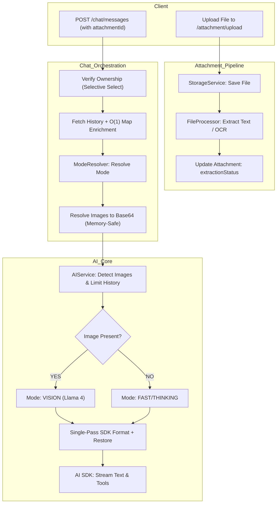

# Better Dev API - Multi-Modal Architecture (Current)

This document describes the modern, multi-modal architecture of the Better Dev API, which supports text, images, and documents (PDFs, Docx) with optimized data flow and resource management.

## 🏗️ High-Level Design (HLD)

The API operates as a **Multi-Modal AI Engine**. It uses a sophisticated message-part system, an asynchronous file processing pipeline, and dynamic model routing.

### System Components

- **Attachment Module:** Handles file uploads, multi-backend storage (S3/Local), and content extraction (OCR/PDF Parsing) with managed worker lifecycles.
- **Multi-Part Message System:** Replaces simple text with a `parts` array, allowing mixed media (Text + Images + Files) in a single message.
- **Dynamic Mode Routing:** 
    - **Fast/Thinking:** User-selected modes for text/reasoning.
    - **Vision:** Auto-detected mode when images are present, routing to visual models (e.g., Llama 4 Vision).
- **O(1) Context Enrichment:** Uses a Map-based lookup strategy to instantly inject extracted text from documents into the AI context window.
- **Vision History Window:** Automatically manages conversation history to stay within model limits (max 5 images), keeping only the most recent visual context.

---

## 📂 Key Modules & Responsibilities

### 1. Attachment Module (`src/modules/attachment`)
*The gateway for all visual and document-based data.*

- **`storage.service.ts`**: Abstracts storage logic (S3/Local). Supports retrieval by `attachmentId` for efficient image resolution.
- **`file-processor.service.ts`**: The "Parser" & "OCR Engine".
    - **Lifecycle Management:** Implements `OnModuleDestroy` to gracefully terminate Tesseract workers, preventing memory leaks.
    - **Images:** Uses **Tesseract.js** for OCR and **Sharp** for thumbnailing.
    - **PDFs:** Uses **pdf-parse** (v1.1.1) to extract text.
    - **Documents:** Uses **mammoth** to convert Word docs to text.
- **`attachment.service.ts`**: Coordinates uploads, enforces file size limits, and triggers the async processing pipeline.

### 2. Multi-Part Chat System (`src/modules/chat`)
*Handling complex conversations with industrial efficiency.*

- **`chat.service.ts`**: The central orchestrator.
    - **Subquery Batching:** `getUserConversations` uses a `distinctOn` subquery to fetch the entire conversation list and their latest message previews in a single, lightweight database call.
    - **O(1) Enrichment:** `getUIMessages` pre-fetches all attachments for a conversation into a `Map`, replacing $O(N^2)$ array searches with instant lookups.
    - **Memory-Safe Resolution:** `resolveImageParts` swaps local file paths for Base64 data strings using `Promise.all` without deep-cloning history, preventing memory spikes.
- **`message.entity.ts`**: Uses `parts` (JSONB) to store mixed modalities.
- **`mode-resolver.service.ts`**: Determines the *Operational Mode* (Fast/Thinking/Auto) based on user preference or complexity analysis.

### 3. Core AI & Vision (`src/modules/core`)
*The intelligence layer.*

- **`ai.service.ts`**: 
    - **Single-Pass Transformation:** `streamResponseWithMode` performs all message sanitization and model formatting in one pass.
    - **Vision History Window:** Detects and limits images in the thread to the last **3 user messages**, converting older images to text placeholders to prevent model context crashes.
    - **Model Selection:**
        - **Vision:** `meta-llama/llama-4-scout-17b-16e-instruct`
        - **Tools/Thinking:** `llama-3.3-70b-versatile`
        - **Fast/Text:** `llama-3.1-8b-instant`
    - **SDK Patch (Enhanced):**
        1. Normalizes custom parts (files/attachments) to standard AI SDK types.
        2. Converts to `ModelMessage` format for strict provider compliance.
        3. **Index-Safe Restoration:** Re-injects image data into user messages after SDK transformation, matching by sequential order to ensure zero data loss.

---

## 🔄 Multi-Modal Data Flow



---

## 🔬 Detailed Implementation Notes (Optimizations)

### 1. Efficient Conversation Listing
- **Problem:** Loading the conversation sidebar was loading every message in history for every conversation, causing huge memory bloat.
- **Solution:** Switched to a **Subquery Strategy** in `getUserConversations`. It now selects only the metadata and the latest message per conversation using `distinctOn` and `orderBy`.

### 2. O(1) Attachment Enrichment
- **Problem:** Long chats with many files caused $O(N \times M)$ slowdowns as every message part searched through an array of attachments.
- **Solution:** `getUIMessages` now builds a `Map<string, Attachment>` once. Lookups are now $O(1)$ (instant), regardless of how many files are in the chat.

### 3. Vision History Window
- **Problem:** Groq/Llama models crash with "Too many images" if the chat history exceeds 5 images.
- **Solution:** `AIService` now counts images from the end of the history. Only the most recent **3 user messages** retain their visual data; older ones are converted to `[Image Omitted]` to save context.

### 4. Single-Pass Transformation & Restoration
- **Problem:** Multiple transformation passes were stripping tool calls and occasionally crashing on strict SDK rules.
- **Solution:** Refactored to a unified pipeline:
    1. **Format:** Normalize `file` parts to `text`.
    2. **Convert:** Use `convertToModelMessages` for strict SDK compliance.
    3. **Restore:** Re-inject images and tool calls into the final `content` array using sequential matching.

---

## 📊 Entity Relationship Diagram (ERD)

- **Conversation** (1 : N) **Message**
- **Message** (1 : N) **Attachment**
- **Message** (JSONB) **parts**: 
  ```json
  [
    { "type": "text", "text": "Analyze this..." }, 
    { "type": "image", "attachmentId": "uuid..." }, 
    { "type": "file", "attachmentId": "uuid..." }
  ]
  ```

---

## 🛠️ Key Architectural Patterns

- **Subquery Batching:** Prevents "N+1" message loading in the sidebar.
- **Map-Based Enrichment:** Replaces linear searches with instant lookups.
- **Vision History Window:** Automatically manages model context limits.
- **Memory-Safe Mapping:** Avoids `JSON.stringify` clones on heavy Base64 data.
- **Index-Safe Restoration:** Sequential message tracking ensures images survive SDK formatting.

---

## 🐛 Common Issues & Debugging

### Issue: "Too many images provided" Error
**Cause:** Chat history contains > 5 images.
**Solution:** The system now automatically prunes images from history. Verify `MAX_IMAGES` in `ai.service.ts`.

### Issue: "Invalid prompt: The messages must be a ModelMessage[]"
**Cause:** Manual transformation sent system messages as parts instead of strings.
**Solution:** Reverted to `convertToModelMessages` followed by a targeted image restoration patch.

### Issue: Image blindness in Vision Mode
**Cause:** SDK stripping image parts.
**Solution:** Check `AIService` logs for `Restoring images for user message`. Verify sequential matching isn't skipping messages.

---

## 📋 Testing Checklist

1. **Sidebar Loading:** Sidebar loads instantly even with 50+ conversations.
2. **Image Context:** AI can see images in the most recent 3 user messages.
3. **History Cleanup:** Oldest images in a long thread are replaced by text placeholders.
4. **Tool Calls:** Web search still works and shows status in the UI.
5. **Memory:** Server memory remains stable during large multimodal requests.
