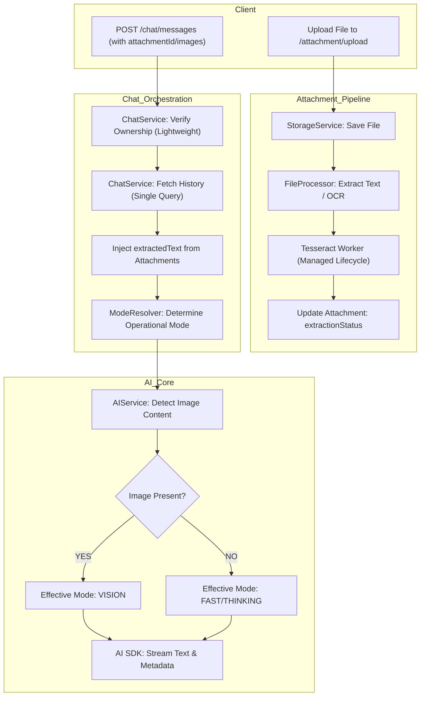

# Better Dev API - Multi-Modal Architecture (Current)

This document describes the modern, multi-modal architecture of the Better Dev API, which supports text, images, and documents (PDFs, Docx) with optimized data flow and resource management.

## 🏗️ High-Level Design (HLD)

The API operates as a **Multi-Modal AI Engine**. It uses a sophisticated message-part system, an asynchronous file processing pipeline, and dynamic model routing.

### System Components

- **Attachment Module:** Handles file uploads, multi-backend storage (S3/Local), and content extraction (OCR/PDF Parsing) with managed worker lifecycles.
- **Multi-Part Message System:** Replaces simple text with a `parts` array, allowing mixed media (Text + Images + Files) in a single message.
- **Dynamic Mode Routing:** 
    - **Fast/Thinking:** User-selected modes for text/reasoning.
    - **Vision:** Auto-detected mode when images are present, routing to visual models (e.g., Llama 4 Scout).
- **Context Injection (RAG-Light):** Extracts text from documents and injects it directly into the context window, with intelligent truncation.

---

## 📂 Key Modules & Responsibilities

### 1. Attachment Module (`src/modules/attachment`)
*The gateway for all visual and document-based data.*

- **`storage.service.ts`**: Abstracts storage logic (S3/Local).
- **`file-processor.service.ts`**: The "Parser" & "OCR Engine".
    - **Lifecycle Management:** Implements `OnModuleDestroy` to gracefully terminate Tesseract workers, preventing memory leaks.
    - **Images:** Uses **Tesseract.js** for OCR and **Sharp** for thumbnailing.
    - **PDFs:** Uses **pdf-parse** (v1.1.1) to extract text.
    - **Documents:** Uses **mammoth** to convert Word docs to text.
- **`attachment.service.ts`**: Coordinates uploads, enforces file size limits, and triggers the async processing pipeline.

### 2. Multi-Part Chat System (`src/modules/chat`)
*Handling complex conversations efficiently.*

- **`chat.service.ts`**: The central orchestrator.
    - **Optimized Data Flow:** Fetches conversation history **only once** per request to reduce DB load (50% read reduction).
    - **Efficient Validation:** Uses lightweight queries for ownership and duplicate checks.
    - **Context Management:** Aggregates text from messages and attachment `extractedText`.
    - **Truncation:** Automatically cuts off document text exceeding ~32k tokens to ensure LLM stability.
- **`message.entity.ts`**: Uses `parts` (JSONB) to store mixed modalities.
- **`mode-resolver.service.ts`**: Determines the *Operational Mode* (Fast/Thinking/Auto) based on user preference or complexity analysis.

### 3. Core AI & Vision (`src/modules/core`)
*The intelligence layer.*

- **`ai.service.ts`**: 
    - **Single Streaming Entrypoint:** `streamResponseWithMode` handles all interaction types.
    - **Vision Detection:** Scans message parts for image data (Base64/URL).
    - **Effective Mode Switching:** If images are found, overrides the requested mode to `vision`.
    - **Model Selection:**
        - **Vision:** `meta-llama/llama-4-scout-17b-16e-instruct`
        - **Tools/Thinking:** `llama-3.3-70b-versatile`
        - **Fast/Text:** `llama-3.1-8b-instant`

---

## 🔄 Multi-Modal Data Flow



---

## 📊 Entity Relationship Diagram (ERD)

- **Conversation** (1 : N) **Message**
- **Message** (1 : N) **Attachment**
- **Message** (JSONB) **parts**: 
  ```json
  [
    { "type": "text", "text": "Analyze this..." }, 
    { "type": "image", "image": "data:image/..." }, 
    { "type": "file", "attachmentId": "uuid..." }
  ]
  ```

---

## 🛠️ Key Architectural Patterns

- **Optimized Read-Path:** Single-query history loading prevents "N+1" style redundant fetches during the request lifecycle.
- **Effective Mode Pattern:** Separation of "Requested Mode" (User intent) and "Effective Mode" (System requirement, e.g., Vision).
- **Worker Lifecycle Management:** Explicit termination of resource-heavy workers (OCR) on application shutdown.
- **Threshold Strategy:** Enforces token-based limits (32k/64k) to maintain performance before transitioning to full RAG.
- **Multi-Part Serialization:** Native support for mixed media messages in database and API contracts.
