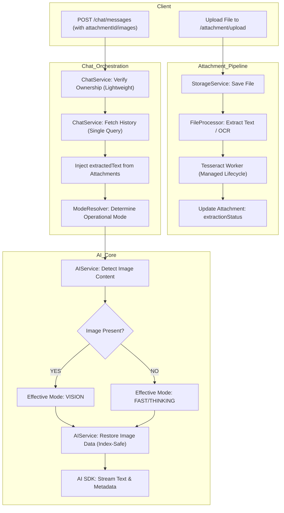

# Better Dev API - Multi-Modal Architecture (Current)

This document describes the modern, multi-modal architecture of the Better Dev API, which supports text, images, and documents (PDFs, Docx) with optimized data flow and resource management.

## 🏗️ High-Level Design (HLD)

The API operates as a **Multi-Modal AI Engine**. It uses a sophisticated message-part system, an asynchronous file processing pipeline, and dynamic model routing.

### System Components

- **Attachment Module:** Handles file uploads, multi-backend storage (S3/Local), and content extraction (OCR/PDF Parsing) with managed worker lifecycles.
- **Multi-Part Message System:** Replaces simple text with a `parts` array, allowing mixed media (Text + Images + Files) in a single message.
- **Dynamic Mode Routing:** 
    - **Fast/Thinking:** User-selected modes for text/reasoning.
    - **Vision:** Auto-detected mode when images are present, routing to visual models (e.g., Llama 4 Scout).
- **Context Injection (RAG-Light):** Extracts text from documents and injects it directly into the context window, with intelligent truncation.

---

## 📂 Key Modules & Responsibilities

### 1. Attachment Module (`src/modules/attachment`)
*The gateway for all visual and document-based data.*

- **`storage.service.ts`**: Abstracts storage logic (S3/Local).
- **`file-processor.service.ts`**: The "Parser" & "OCR Engine".
    - **Lifecycle Management:** Implements `OnModuleDestroy` to gracefully terminate Tesseract workers, preventing memory leaks.
    - **Images:** Uses **Tesseract.js** for OCR and **Sharp** for thumbnailing.
    - **PDFs:** Uses **pdf-parse** (v1.1.1) to extract text. *Note: Downgraded to v1.1.1 to resolve runtime incompatibility issues.*
    - **Documents:** Uses **mammoth** to convert Word docs to text.
- **`attachment.service.ts`**: Coordinates uploads, enforces file size limits, and triggers the async processing pipeline.

### 2. Multi-Part Chat System (`src/modules/chat`)
*Handling complex conversations efficiently.*

- **`chat.service.ts`**: The central orchestrator.
    - **Optimized Data Flow:** Fetches conversation history **only once** per request to reduce DB load (50% read reduction).
    - **Efficient Validation:** Uses lightweight queries for ownership and duplicate checks.
    - **Context Management:** Aggregates text from messages and attachment `extractedText`.
    - **Truncation:** Automatically cuts off document text exceeding ~32k tokens to ensure LLM stability.
- **`message.entity.ts`**: Uses `parts` (JSONB) to store mixed modalities.
- **`mode-resolver.service.ts`**: Determines the *Operational Mode* (Fast/Thinking/Auto) based on user preference or complexity analysis.

### 3. Core AI & Vision (`src/modules/core`)
*The intelligence layer.*

- **`ai.service.ts`**: 
    - **Single Streaming Entrypoint:** `streamResponseWithMode` handles all interaction types.
    - **Vision Detection:** Scans message parts for image data (Base64/URL).
    - **Effective Mode Switching:** If images are found, overrides the requested mode to `vision`.
    - **Model Selection:**
        - **Vision:** `meta-llama/llama-4-scout-17b-16e-instruct`
        - **Tools/Thinking:** `llama-3.3-70b-versatile`
        - **Fast/Text:** `llama-3.1-8b-instant`
    - **SDK Patch (Critical):** Includes a manual image restoration process that:
        1. Filters user messages with images from `formattedMessages`
        2. Tracks user message order separately using `userMsgIndex`
        3. Reconstructs the `content` array with preserved image Base64 data
        4. Ensures images survive the `convertToModelMessages` transformation
    - **Why This Matters:** Without this patch, the AI Vision model would receive empty content arrays, causing it to respond with "I don't see any image" despite the frontend sending image data correctly.

---

## 🔄 Multi-Modal Data Flow



---

## 🔬 Detailed Implementation Notes (Recent Changes)

### 1. PDF Parsing Fix
- **Issue:** `pdf-parse` v2.x caused "pdf is not a function" errors due to export changes.
- **Fix:** Downgraded to **v1.1.1** and used `require('pdf-parse')` to ensure stable text extraction from buffers.

### 2. AI SDK Image Handling Patch (Critical)
- **Issue 1:** The Vercel AI SDK's `convertToModelMessages` utility was stripping `parts` containing images when converting `UIMessage` to `ModelMessage`.
- **Fix 1:** Implemented a manual post-processing step in `AIService` that re-injects the image data (Base64) into the `content` array of the user message *before* sending it to the Groq API.
- **Issue 2 (Index Mismatch Bug):** The initial image restoration logic assumed array indices would match between `formattedMessages` and `modelMessages`, but `convertToModelMessages` can reorder or restructure the array, causing images to be lost or applied to wrong messages.
- **Fix 2:** Refactored the image restoration logic to track user messages separately by their sequential order (`userMsgIndex`), rather than relying on absolute array indices. This ensures each user message in `modelMessages` is correctly matched with its corresponding message in `formattedMessages`, preserving image data through the transformation pipeline.
- **Result:** The Vision model now correctly receives image data for all user messages containing images.

### 3. Tesseract Resource Management
- **Issue:** Spawning a new Tesseract worker for every image request caused high CPU/Memory overhead and potential leaks.
- **Fix:** Implemented `OnModuleDestroy` in `FileProcessorService` to maintain a singleton worker instance (or pool) and ensure `worker.terminate()` is called when the application shuts down.

### 4. Database Optimization
- **Issue:** `ChatService` was fetching the entire conversation history multiple times (once for ownership, once for context, once for duplicate check).
- **Fix:** Refactored `getUIMessages` to accept an optional `conversation` entity, allowing the service to fetch the conversation metadata once and reuse it. Duplicate checks now query only the *last* message instead of the full history.

---

## 📊 Entity Relationship Diagram (ERD)

- **Conversation** (1 : N) **Message**
- **Message** (1 : N) **Attachment**
- **Message** (JSONB) **parts**: 
  ```json
  [
    { "type": "text", "text": "Analyze this..." }, 
    { "type": "image", "image": "data:image/..." }, 
    { "type": "file", "attachmentId": "uuid..." }
  ]
  ```

---

## 🛠️ Key Architectural Patterns

- **Optimized Read-Path:** Single-query history loading prevents "N+1" style redundant fetches during the request lifecycle.
- **Effective Mode Pattern:** Separation of "Requested Mode" (User intent) and "Effective Mode" (System requirement, e.g., Vision).
- **Worker Lifecycle Management:** Explicit termination of resource-heavy workers (OCR) on application shutdown.
- **Threshold Strategy:** Enforces token-based limits (32k/64k) to maintain performance before transitioning to full RAG.
- **Multi-Part Serialization:** Native support for mixed media messages in database and API contracts.
- **Index-Safe Image Restoration:** Matches user messages by their sequential order rather than absolute array indices to survive SDK transformations.

---

## 🐛 Common Issues & Debugging

### Issue: AI responds "I don't see any image" despite frontend sending image data

**Root Cause:** Image data is being lost during the `UIMessage` → `ModelMessage` transformation.

**Debugging Steps:**
1. **Check Frontend Payload:** Inspect Network tab. Ensure `parts` array contains `{ type: 'image', image: 'data:image/...' }`
2. **Check Backend Logs:** Look for `[DEBUG] Restoring images for user message` in Docker logs
3. **Verify Base64 Length:** Log should show `Adding image part with data length: [large number]`
4. **Check Model Messages:** Log should show `content` array with `{ type: 'image', image: 'data:...' }`

**If image data is present in frontend but not in backend logs:**
- Check `ChatService.saveUIMessage` - Ensure `parts` array is being saved to DB
- Check `ChatService.getUIMessages` - Ensure `parts` are being retrieved correctly

**If image data is in backend logs but model still doesn't see it:**
- Check `AIService.streamResponseWithMode` - The image restoration logic may need adjustment
- Ensure `userMsgIndex` counter is tracking user messages correctly

### Issue: Vision mode activates but wrong image is sent to model

**Root Cause:** Array index mismatch during image restoration.

**Fix Applied:** Changed from `formattedMessages[index]` to sequential user message tracking with `userMsgIndex`.

### Issue: Large PDF uploads cause context window overflow

**Mitigation:** 
- Document text is truncated to ~32k tokens (128k characters) per file
- Total context size is monitored and logged as warning if exceeding 64k tokens
- Frontend should enforce max 10MB file size

### Issue: OCR/PDF processing never completes

**Debugging:**
- Check `attachments` table for `extractionStatus` (should be `processing` → `success`)
- Check Docker logs for `FileProcessorService` errors
- Verify Tesseract worker is running: Look for `Terminating Tesseract Worker` on shutdown

---

## 📋 Testing Checklist

Before deploying multimodal features:

1. **Text Only:**
   - [ ] Fast mode responds quickly (< 2s)
   - [ ] Thinking mode provides detailed analysis

2. **Image Upload:**
   - [ ] Image appears in chat UI
   - [ ] AI describes image content accurately
   - [ ] `effectiveMode` metadata shows `'vision'`
   - [ ] Backend logs show `Restoring images for user message`

3. **Document Upload:**
   - [ ] PDF text extraction completes
   - [ ] DOCX text extraction completes
   - [ ] AI can answer questions about document content
   - [ ] Large documents (> 100 pages) are truncated gracefully

4. **Mixed Content:**
   - [ ] Text + Image in same message works
   - [ ] Text + File in same message works
   - [ ] Multiple images in same message works

5. **Edge Cases:**
   - [ ] Empty message with only image works
   - [ ] Very large image (8MB) uploads successfully
   - [ ] Duplicate message detection works
   - [ ] Vision mode auto-activates (not manually selectable)
