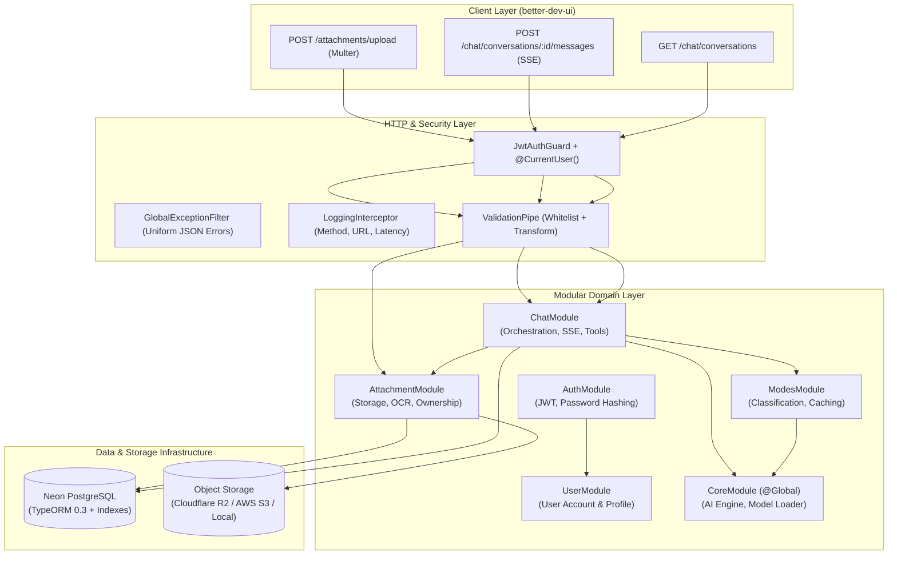

# Better Dev API - Production Multi-Modal Architecture (Current)

This document describes the modern, modular, and multi-modal architecture of the Better Dev API, supporting text, images, and documents (PDFs, Docx) with optimized data flow, transactional safety, and clean separation of concerns.

---

## 🏗️ High-Level Design (HLD)

The API operates as a **Modular Multi-Modal AI Engine** built on NestJS 11 and Vercel AI SDK v5.


```mermaid
graph TD
    subgraph Client_Layer["Client Layer (better-dev-ui)"]
        UI_Upload["POST /attachments/upload (Multer)"]
        UI_Chat["POST /chat/conversations/:id/messages (SSE)"]
        UI_List["GET /chat/conversations"]
    end

    subgraph HTTP_Middleware["HTTP & Security Layer"]
        Guard["JwtAuthGuard + @CurrentUser()"]
        Filter["GlobalExceptionFilter (Uniform JSON Errors)"]
        Logging["LoggingInterceptor (Method, URL, Latency)"]
        Validation["ValidationPipe (Whitelist + Transform)"]
    end

    subgraph Application_Modules["Modular Domain Layer"]
        AuthM["AuthModule<br/>(JWT, Password Hashing)"]
        UserM["UserModule<br/>(User Account & Profile)"]
        AttachM["AttachmentModule<br/>(Storage, OCR, Ownership)"]
        ChatM["ChatModule<br/>(Orchestration, SSE, Tools)"]
        ModesM["ModesModule<br/>(Classification, Caching)"]
        CoreM["CoreModule (@Global)<br/>(AI Engine, Model Loader)"]
    end

    subgraph Data_Layer["Data & Storage Infrastructure"]
        Postgres[("Neon PostgreSQL<br/>(TypeORM 0.3 + Indexes)")]
        Storage[("Object Storage<br/>(Cloudflare R2 / AWS S3 / Local)")]
    end

    UI_Upload --> Guard --> Validation --> AttachM
    UI_Chat --> Guard --> Validation --> ChatM
    UI_List --> Guard --> Validation --> ChatM

    AuthM --> UserM
    AttachM --> Postgres
    AttachM --> Storage

    ChatM --> ModesM
    ChatM --> AttachM
    ChatM --> CoreM
    ChatM --> Postgres
    ModesM --> CoreM
```

---

## 📂 Key Modules & Responsibilities

### 1. Core Module (`src/modules/core`)
*The foundational AI intelligence layer.*
- **Zero Inverted Dependencies**: Self-contained module with zero dependencies on higher-level domain modules.
- **`ai.service.ts`**: Single-pass model transformation, prompt synthesis, tool calling, and image context management.
- **`config/mode.config.ts`**: Canonical operational mode configurations (Fast, Thinking, Vision).
- **`utils/message.utils.ts`**: Message normalization and AI SDK v5 format converters.

### 2. Modes Module (`src/modules/chat/modes`)
*Operational mode resolution & query routing.*
- **`mode-resolver.service.ts`**: Resolves requested vs. effective operational mode (User Override $\rightarrow$ Auto-Classifier).
- **`auto-classifier.service.ts`**: Fast complexity analysis with heuristic pre-filters.
- **`classification-cache.service.ts`**: In-memory MD5-hashed classification caching (5-minute TTL).

### 3. Attachment Module (`src/modules/attachment`)
*File ingestion, storage abstraction, and content extraction.*
- **Conversation Ownership Verification**: Validates caller owns target `conversationId` prior to storage and database write.
- **`storage.service.ts`**: Unified S3/Cloudflare R2/Local storage driver with native `crypto.randomUUID()`.
- **`attachment.service.ts`**: Encapsulates attachment queries, message linking, and Base64 resolution.
- **`file-processor.service.ts`**: In-process extraction (Tesseract OCR, `pdf-parse`, `mammoth`).

### 4. Chat Module (`src/modules/chat`)
*Conversation lifecycle, SSE streaming, and message persistence.*
- **`chat.controller.ts`**: SSE streaming endpoint with client disconnection handling (`req.on('close')`), type-safe `@CurrentUser()`, and `ParseUUIDPipe`.
- **`chat.service.ts`**:
  - **Transaction Safety**: All multi-step mutations run inside `dataSource.transaction(...)`.
  - **O(1) Map Enrichment**: Pre-fetches attachments into a `Map<string, Attachment>`.
  - **Subquery Batching**: `getUserConversations` fetches recent previews via single `DISTINCT ON` SQL query.

---

## 🛡️ Security, Validation & Reliability

1. **Uniform Error Handling**: `GlobalExceptionFilter` intercepts unhandled exceptions, formats consistent JSON envelopes (`statusCode`, `error`, `message`, `timestamp`, `path`), and logs stack traces for 500 errors.
2. **Type-Safe Request Context**: Custom `@CurrentUser() user: AuthUser` parameter decorator extracts verified token claims without `any` typing.
3. **Deep Payload Validation**: `ChatRequestDto` validates nested `UIMessageInputDto` and `MessagePartDto` arrays with `@ValidateNested({ each: true })`.
4. **Database Indexes**: Composite database indexes on `(conversationId, createdAt ASC)` and `(userId, updatedAt DESC)` prevent sequential table scans.

---

## 🧪 Automated Testing

Automated unit test coverage across all foundational layers:
- `src/modules/auth/auth.service.spec.ts`: Tests user registration, password hashing verification, and JWT login.
- `src/modules/chat/modes/mode-resolver.service.spec.ts`: Tests fast/thinking overrides and auto-classification delegation.
- `src/modules/core/utils/message.utils.spec.ts`: Tests multi-modal text extraction, legacy conversion, and tool detection.
- `src/modules/attachment/services/storage.service.spec.ts`: Tests storage initialization and driver dispatch.

Run test suites:
```bash
npm test
```
