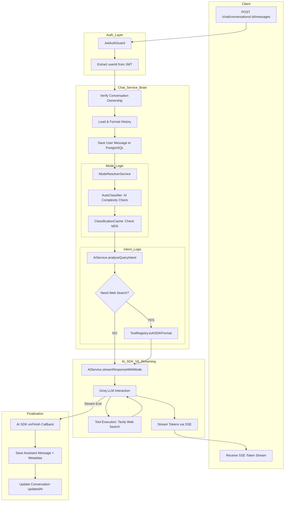

# Better Dev API - Architecture Guide

This document provides a high-level overview of the server architecture, data flows, and module responsibilities for the Better Dev AI platform.

## 🏗️ High-Level Design (HLD)

The Better Dev API is built using **NestJS**, following a modular architecture. It leverages the **AI SDK v5** for streaming responses and **TypeORM** for data persistence.

### System Components

- **API Gateway (NestJS Controllers):** Entry points for client requests, handling authentication and validation.
- **Service Layer:** Contains business logic (Chat, User, Auth, AI).
- **Mode System:** Dynamic model selection system (Fast vs. Thinking).
- **Tool System:** Extensible tool execution framework (e.g., Web Search).
- **Core AI Service:** Abstracted interface for AI model interactions (Groq/LLM).
- **Persistence Layer:** PostgreSQL (via TypeORM) for Users, Conversations, and Messages.

---

## 📂 File Map & Chronological Responsibilities

### 1. Initialization Phase
*How the server starts and prepares itself.*

- `src/main.ts`: Entry point. Bootstraps the NestJS app, sets up global prefixes, validation pipes, and SSE support.
- `src/app.module.ts`: Root module that imports all feature modules (`AuthModule`, `UserModule`, `ChatModule`, `CoreModule`).
- `src/config/*.ts`: Loads environment variables for Database, JWT, and API keys (Groq, Tavily).
- `src/modules/chat/tools/tools.config.ts`: Auto-registers available tools into the `ToolRegistry` on module initialization.

### 2. Authentication & Guarding
*Securing the API.*

- `src/modules/auth/strategies/jwt.strategy.ts`: Validates incoming JWT tokens from the `Authorization` header.
- `src/common/guards/jwt-auth.guard.ts`: Protects routes, ensuring only authenticated users can access chat features.

### 3. Request Lifecycle (Chat Flow)
*The path of a message from user to AI and back.*

- `src/modules/chat/chat.controller.ts`: Receives the POST request. Extracts `userId` and calls the streaming handler.
- `src/modules/chat/chat.service.ts`: The "Brain".
    1. Verifies ownership of the conversation.
    2. Loads history and saves the new user message.
    3. Triggers **Mode Resolution**.
    4. Triggers **Intent Analysis** (Should we use tools?).
    5. Initiates the AI stream.
- `src/modules/chat/modes/mode-resolver.service.ts`: Decides if we use `fast` or `thinking` mode.
- `src/modules/chat/modes/auto-classifier.service.ts`: Uses AI to classify query complexity if "auto" mode is selected.
- `src/modules/core/ai.service.ts`: Communicates with the LLM (Groq) using the AI SDK. Handles system prompts and tool injection.
- `src/modules/chat/tools/tool.registry.ts`: Provides the tools requested by the AI service.

---

## 🔄 Data Flow (User Perspective)

When a user sends a message: "What is the price of Bitcoin today?"

1.  **Request:** Client sends a POST request with the message and `mode: "auto"`.
2.  **Auth:** `JwtAuthGuard` identifies the user via their token.
3.  **Persistence:** The message is immediately saved to the `messages` table in PostgreSQL.
4.  **Classification:**
    - `AutoClassifier` sees the query is short but might need data.
    - It checks the cache. If missed, it asks a small LLM: "Is this SIMPLE or COMPLEX?".
    - Result: `thinking` mode (because it might need web search).
5.  **Intent Analysis:** `AIService` analyzes if tools are needed. It sees "price" and decides `web_search` is appropriate.
6.  **AI Execution:**
    - `AIService` calls Groq with `llama-3.3-70b-versatile`.
    - It attaches the `web_search` tool.
7.  **Tool Call:**
    - The LLM requests a tool call: `tavily_web_search(query: "bitcoin price")`.
    - `WebSearchTool` executes, fetches results from Tavily, and generates a summary.
8.  **Streaming:**
    - The LLM receives the tool output and generates the final answer.
    - Tokens are streamed back to the user via **Server-Sent Events (SSE)**.
9.  **Finalization:** Once streaming ends, the assistant's full response (including tool metadata) is saved to the database.

### 🗺️ Streaming Chat Flow (Visual)

---

## 📊 Entity Relationship Diagram (ERD)

- **User** (1 : N) **Conversation**
- **Conversation** (1 : N) **Message**

Messages contain a `metadata` JSONB field that stores:
- `effectiveMode`: (fast/thinking)
- `modelUsed`: (llama-3.1-8b / llama-3.3-70b)
- `toolCalls`: List of tools executed and their outputs.

---

## 🛠️ Key Architectural Patterns

- **Strategy Pattern:** Used in `ModeResolver` to switch between models.
- **Registry Pattern:** `ToolRegistry` allows for decoupled tool development.
- **Repository Pattern:** TypeORM handles all DB interactions.
- **SSE (Server-Sent Events):** Real-time token streaming for a "ChatGPT-like" experience.
