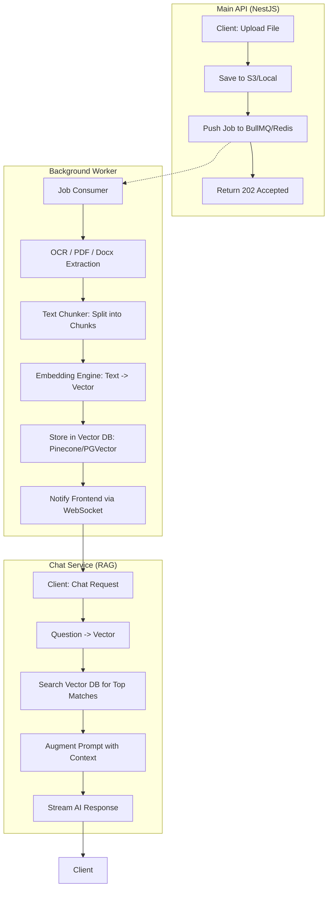

# Better Dev API - Proposed Production Architecture (Multi-Modal + RAG + Workers)

This document outlines the proposed "Gold Standard" architecture for the Better Dev API. It combines **Event-Driven Background Processing** with **Vector-Based Retrieval Augmented Generation (RAG)** to ensure scalability, performance, and cost-efficiency.

## 🏗️ High-Level Design (HLD)

The proposed architecture transitions from a single-process model to a distributed, event-driven system.

### 1. Main API Service (NestJS)
- **Role:** Handles user authentication, conversation management, and real-time streaming.
- **Change:** No longer performs CPU-heavy tasks (OCR/Parsing). Instead, it acts as a "Job Producer".

### 2. Background Worker Service (BullMQ + Redis)
- **Role:** The "Heavy Lifter". Processes the queue of files uploaded by users.
- **Operations:** Performs OCR, PDF parsing, text chunking, and vector embedding generation.
- **Benefit:** Prevents the main API from freezing and handles retries automatically if a service (like Tesseract) fails.

### 3. Vector Knowledge Base (Pinecone / PGVector)
- **Role:** Stores "mathematical representations" (vectors) of document chunks.
- **Benefit:** Allows the AI to "search" through thousands of pages in milliseconds and retrieve only the most relevant sections for a user's question.

---

## 🔄 Proposed Data Flow

### Phase A: Asynchronous File Ingestion (The "Reading" Phase)
1. **Upload:** User uploads a document (PDF/Image).
2. **Queueing:** API saves the file to S3 and pushes a `FILE_PROCESS` job to **BullMQ (Redis)**.
3. **Extraction:** The **Worker** picks up the job, performs OCR/Parsing.
4. **Chunking:** The worker splits the text into small, overlapping chunks (e.g., 500 characters each).
5. **Embedding:** The worker sends chunks to an **Embedding Model** (e.g., OpenAI `text-embedding-3-small`).
6. **Indexing:** Vectors and original text are stored in the **Vector DB**.
7. **Notify:** System sends a **WebSocket** event to the client: `"status": "ready_to_chat"`.

### Phase B: Contextual Chat (The "RAG" Phase)
1. **Query:** User asks: *"What does the contract say about termination?"*
2. **Retrieve:** 
    - API converts the user's question into a vector.
    - API queries the **Vector DB** for the top 3 most relevant chunks from that specific document.
3. **Augment:** API builds a "Super Prompt":
   > "Use the following context to answer the question: [Chunk 1], [Chunk 2], [Chunk 3]. Question: What does the contract say about termination?"
4. **Stream:** AI generates a highly accurate answer based *only* on the provided context.

---

## 🗺️ Visual Flowchart

---

## 🛠️ Recommended Technical Stack

| Component | Technology | Why? |
| :--- | :--- | :--- |
| **Queue Manager** | **BullMQ + Redis** | Industry standard for NestJS; supports retries, priorities, and delayed jobs. |
| **Vector DB** | **Supabase (pgvector)** | You already use PostgreSQL; pgvector is the easiest way to add RAG without a new service. |
| **Embeddings** | **OpenAI text-embedding-3-small** | Extremely cheap ($0.02 per 1M tokens) and highly accurate. |
| **WebSockets** | **Socket.io (NestJS Gateway)** | Provides real-time status updates to the user. |
| **Worker Process** | **Dedicated NestJS App** | Can be scaled independently of the API (e.g., more workers for heavy OCR load). |

---

## 📊 Comparison: Current vs. Proposed

| Feature | Current (Multi-Modal Branch) | Proposed (Production) |
| :--- | :--- | :--- |
| **CPU Usage** | High (blocks API during OCR) | Low (Main API is always responsive) |
| **Memory Capacity** | Limited by LLM Context Window | Unlimited (RAG scales to millions of pages) |
| **Cost per Message** | High (sending full documents) | Low (sending only 3 relevant chunks) |
| **Reliability** | No retries if processing fails | Automatic retries via BullMQ |
| **UX** | Silent loading (Wait & Hope) | Real-time progress bars via WebSockets |
